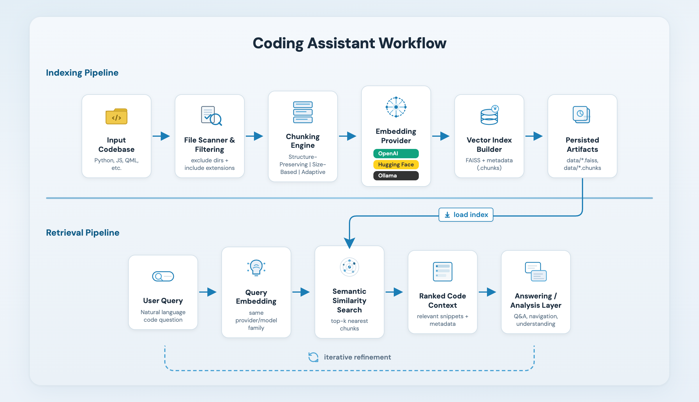

# Code RAG System

A flexible Retrieval-Augmented Generation (RAG) system designed for code analysis and understanding. This system provides intelligent code chunking, flexible embedding generation, and semantic search capabilities.

## Features

- **Intelligent Code Chunking**: Multiple chunking strategies optimized for different code analysis needs
- **Flexible Embedding System**: Support for multiple embedding providers (OpenAI, Hugging Face, Ollama)
- **Semantic Search**: Advanced retrieval capabilities for code understanding
- **Multi-Language Support**: Handles Python, JavaScript, QML, and other programming languages
- **Modular Architecture**: Easy to extend and customize

## Workflow



## Quick Start

```python
from code_rag.indexing.index_builder import IndexBuilder
from code_rag.retrieval.code_search import CodeSearch

# Build index with OpenAI embeddings
builder = IndexBuilder(
    project_directory="/path/to/your/code",
    data_directory="/path/to/data",
    embedding_provider='openai',
    embedding_model='text-embedding-3-small'
)
builder.build_index()

# Search your code
searcher = CodeSearch(data_directory="/path/to/data")
results = searcher.search("authentication implementation", k=5)
```

## Chunking Strategies

The system supports three chunking strategies:

1. **STRUCTURE_PRESERVING**: Maintains semantic units like functions and classes
2. **SIZE_BASED**: Simple size-based chunking for uniform processing
3. **ADAPTIVE_STRUCTURE**: Intelligent splitting that adapts to code structure

## Flexible Embedding Providers

The embedding system supports multiple providers through a modular architecture:

- **OpenAI** - Cloud-based embeddings (requires API key)
- **Hugging Face** - Local embeddings using sentence-transformers
- **Ollama** - Local embeddings using Ollama server

### Architecture

#### Core Components

1. **`BaseEmbeddingProvider`** - Abstract base class for all providers
2. **Provider Implementations** - OpenAI, Hugging Face, Ollama
3. **`EmbeddingProviderFactory`** - Factory for creating providers
4. **`EmbeddingProcessor`** - Updated to use the provider system

#### Directory Structure

```
code_rag/indexing/embeddings/
├── __init__.py
├── base_provider.py           # Abstract base class
├── openai_provider.py         # OpenAI implementation
├── huggingface_provider.py    # Hugging Face implementation
├── ollama_provider.py         # Ollama implementation
└── provider_factory.py       # Factory for creating providers
```

### Usage

#### Basic Usage

```python
from code_rag.indexing.embedding_processor import EmbeddingProcessor

# OpenAI (default)
processor = EmbeddingProcessor(
    provider_type='openai',
    model_name='text-embedding-3-small'
)

# Hugging Face
processor = EmbeddingProcessor(
    provider_type='huggingface',
    model_name='all-MiniLM-L6-v2',
    device='cpu'
)

# Ollama
processor = EmbeddingProcessor(
    provider_type='ollama',
    model_name='nomic-embed-text',
    host='http://localhost:11434'
)
```

#### Convenience Methods

```python
# OpenAI
processor = EmbeddingProcessor.create_openai_processor(
    model_name='text-embedding-3-small'
)

# Hugging Face
processor = EmbeddingProcessor.create_huggingface_processor(
    model_name='all-MiniLM-L6-v2',
    device='cpu'
)

# Ollama
processor = EmbeddingProcessor.create_ollama_processor(
    model_name='nomic-embed-text'
)
```

#### With IndexBuilder

```python
from code_rag.indexing.index_builder import IndexBuilder

# OpenAI
builder = IndexBuilder(
    project_directory="/path/to/code",
    data_directory="/path/to/data",
    embedding_provider='openai',
    embedding_model='text-embedding-3-small'
)

# Hugging Face
builder = IndexBuilder(
    project_directory="/path/to/code",
    data_directory="/path/to/data",
    embedding_provider='huggingface',
    embedding_model='all-MiniLM-L6-v2',
    embedding_config={'device': 'cpu'}
)

# Ollama
builder = IndexBuilder(
    project_directory="/path/to/code",
    data_directory="/path/to/data",
    embedding_provider='ollama',
    embedding_model='nomic-embed-text'
)
```

### Environment Variables

Configure providers using environment variables:

#### OpenAI

```bash
export EMBEDDING_PROVIDER=openai
export EMBEDDING_MODEL=text-embedding-3-small
export OPENAI_API_KEY=your_api_key
export OPENAI_BATCH_SIZE=100
export OPENAI_RATE_LIMIT_DELAY=0.1
```

#### Hugging Face

```bash
export EMBEDDING_PROVIDER=huggingface
export EMBEDDING_MODEL=all-MiniLM-L6-v2
export HF_DEVICE=cpu
export HF_BATCH_SIZE=32
export HF_NORMALIZE=true
```

#### Ollama

```bash
export EMBEDDING_PROVIDER=ollama
export EMBEDDING_MODEL=nomic-embed-text
export OLLAMA_HOST=http://localhost:11434
export OLLAMA_BATCH_SIZE=16
export OLLAMA_TIMEOUT=30
```

### Provider Details

#### OpenAI Provider

**Features:**

- Cloud-based embeddings
- Rate limiting and retry logic
- Batch processing

**Supported Models:**

- `text-embedding-3-small` (1536 dimensions)
- `text-embedding-3-large` (3072 dimensions)
- `text-embedding-ada-002` (1536 dimensions)

**Requirements:**

- `openai>=1.0.0`
- OpenAI API key

#### Hugging Face Provider

**Features:**

- Local embeddings
- No API key required
- Supports any sentence-transformers model

**Popular Models:**

- `all-MiniLM-L6-v2` (384 dimensions)
- `all-mpnet-base-v2` (768 dimensions)
- `multi-qa-mpnet-base-dot-v1` (768 dimensions)

**Requirements:**

- `sentence-transformers>=2.2.0`
- `torch>=1.9.0`
- `transformers>=4.20.0`

#### Ollama Provider

**Features:**

- Local embeddings through Ollama server
- Supports various open-source models
- Self-hosted solution

**Popular Models:**

- `nomic-embed-text` (768 dimensions)
- `all-minilm` (384 dimensions)
- `snowflake-arctic-embed` (1024 dimensions)

**Requirements:**

- `ollama>=0.1.0`
- Ollama server running locally
- Models installed via `ollama pull <model_name>`

## Installation

### Core Dependencies

```bash
pip install openai numpy faiss-cpu python-dotenv
```

### Optional Dependencies

```bash
# For Hugging Face
pip install sentence-transformers torch transformers

# For Ollama
pip install ollama

# Or install all at once
pip install -r requirements.txt
```

## Migration Guide

### From Old System

**Old:**

```python
from code_rag.indexing.embedding_processor import EmbeddingProcessor

processor = EmbeddingProcessor(
    api_key="your_key",
    model_name="text-embedding-3-small"
)
```

**New (backward compatible):**

```python
from code_rag.indexing.embedding_processor import EmbeddingProcessor

# Still works (backward compatibility)
processor = EmbeddingProcessor.create_openai_processor(
    api_key="your_key",
    model_name="text-embedding-3-small"
)

# Or use new flexible system
processor = EmbeddingProcessor(
    provider_type='openai',
    model_name='text-embedding-3-small',
    api_key="your_key"
)
```

## Examples

See `examples/embedding_providers_example.py` for a complete demonstration of all providers.

Check out the `examples/` directory for more usage examples:

- `simple_usage.py` - Basic usage example
- `build_and_query.py` - Complete workflow example
- `chunk_and_query.py` - Chunking strategy examples
- `embedding_providers_example.py` - All embedding providers demonstration

## Benefits

1. **Flexibility** - Choose between cloud and local models
2. **Cost Control** - Use free local models when appropriate
3. **Performance** - Local models avoid API latency
4. **Privacy** - Local models keep data private
5. **Scalability** - No API rate limits with local models
6. **Backward Compatibility** - Existing code continues to work

## Error Handling

The system provides clear error messages for common issues:

- Missing dependencies
- Invalid API keys
- Unavailable models
- Network connectivity issues

## Future Extensions

The modular design allows for easy addition of new providers:

1. Create a new provider class inheriting from `BaseEmbeddingProvider`
2. Register it in the `EmbeddingProviderFactory`
3. Add any necessary configuration options

Potential future providers:

- Azure OpenAI
- Google AI
- Anthropic
- Cohere
- Custom API endpoints

## Contributing

Contributions are welcome! Please ensure code follows the established patterns and includes appropriate tests.

## License

This project is licensed under the MIT License.
